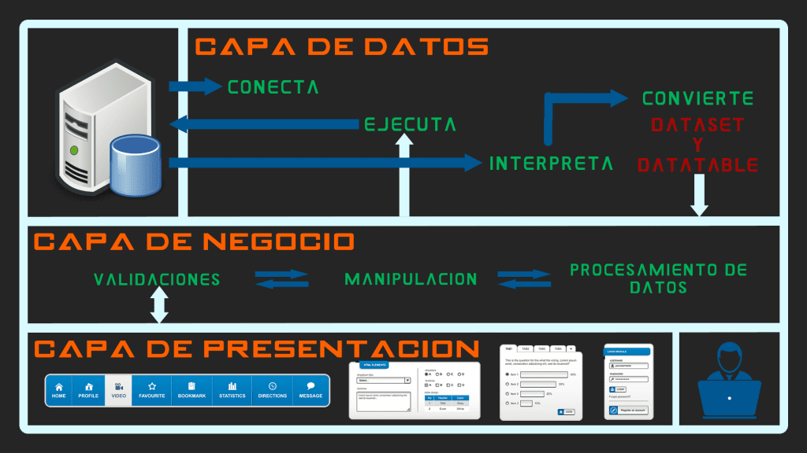

# patrones arquitectonicos
> [!NOTE]
> 👍 un **patron arquitectonicos** es una solucion general y reutilizable a un problema comun en la arquitectura de software dentro de un contexto dado. los patrones arquitectonicos son la havilidad de organizacion a nivel de carpeta dentro del proyecto de software.

PATRONES ARQUETECTONICOS MAS CONOCIDOS
1. PATRON DE CAPAS 
2. PATRON CLIENTES-SERVIDOR
3. PATRON MAESTRO-ESCLAVO
4. PATRON FILTRO DE TUBERIA
5. PATRON DE INTERMEDIARIO
6. PATRON DE IGUAL A IGUAL
7. PATRON DE BUS ENVENTO
8. MODELO-VISTA-CONTROLODAR
9. ARQUITECTURA LIMPIA
10. ARQUITECTURA HEXAGONAL

# PATRON DE CAPAS
## Introduccion
> [!CAUTION]
> 👻Es un patrón de diseño de software que se utiliza para organizar y estructurar una aplicación en capas lógicas y funcionales. Este enfoque arquitectónico divide una aplicación en capas distintas, donde cada capa tiene una responsabilidad específica y se comunica con capas adyacentes de manera controlada.
> 
> Las capas en una arquitectura en capas suelen estar organizadas de manera jerárquica, con capas superiores que dependen de capas inferiores pero no al revés.

# TIPOS DE CAPAS

# Capas de presentacion (interfas de usuario)
Esta es la capa más externa de la aplicación que interactúa con los usuarios.
Se encarga de presentar la información al usuario y de capturar las interacciones del usuario.
Puede incluir interfaces gráficas de usuario (GUI), páginas web, servicios web, etc.

# Capa de Lógica de Negocio (Capa de Aplicación):
Esta capa contiene la lógica de negocio y las reglas de negocio de la aplicación.
Se encarga de procesar la información, realizar cálculos, validar datos y tomar decisiones basadas en la lógica empresarial.

# Capa de Acceso a Datos:
Esta capa se encarga de interactuar con la base de datos o cualquier otro mecanismo de almacenamiento de datos.
Realiza operaciones de lectura, escritura, actualización y eliminación de datos en la base de datos.

# Capa de Infraestructura
Esta capa proporciona servicios de soporte para las capas superiores, como la gestión de la configuración, la seguridad, el registro, la autenticación, etc.
Puede incluir servicios compartidos, bibliotecas de utilidades, servicios de mensajería, etc.

# Conclucion

El patrón de capas promueve la separación de preocupaciones y la modularidad en el diseño de software, lo que facilita la escalabilidad, mantenibilidad y reutilización del código. Al dividir la aplicación en capas, se logra un diseño más estructurado y fácil de entender, lo que facilita el desarrollo y la evolución de la aplicación a lo largo del tiempo.

